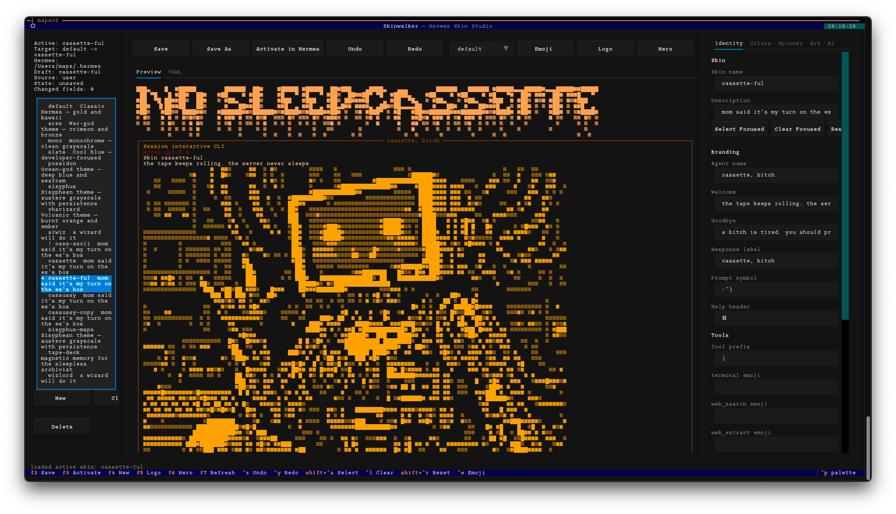
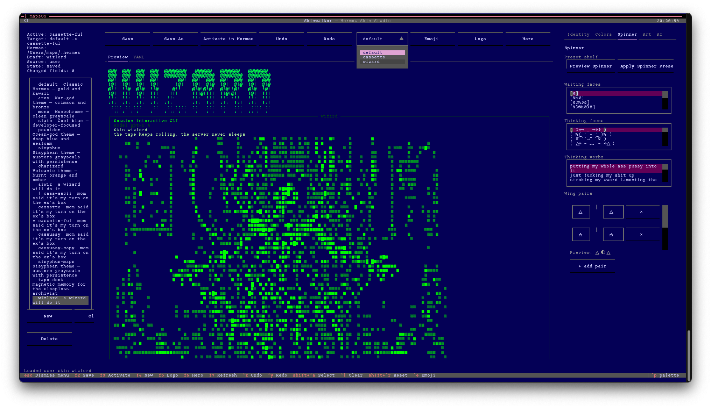
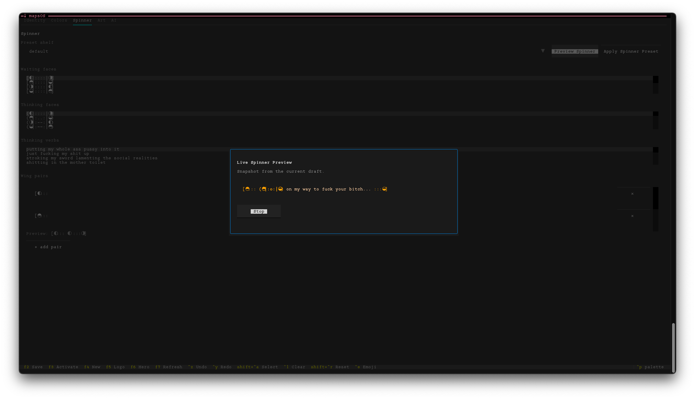
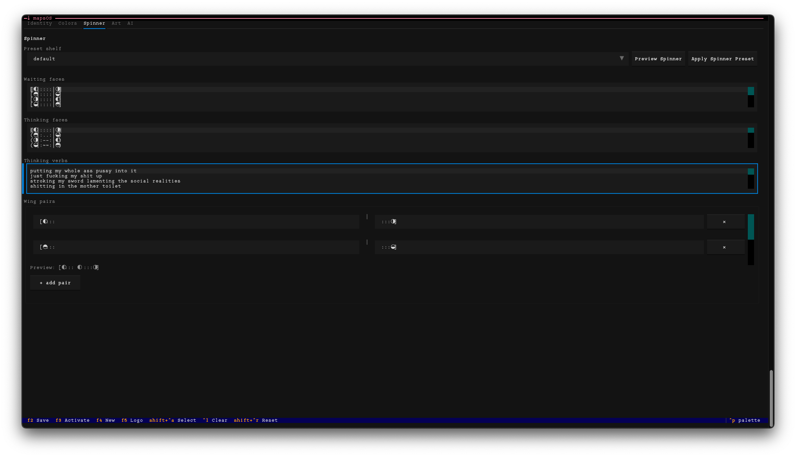

# Skinwalker

Skinwalker is a Textual-based TUI for creating, editing, previewing, and activating Hermes CLI skins.

This repository now also includes `imagewalker`, a standalone local image-to-ASCII tool built on the same rendering stack as Skinwalker's Art tab.

It is aimed at the full Hermes skin surface rather than a toy theme picker. The app reads real built-in skins from Hermes, edits the real skin schema, saves custom skins into the active Hermes home, and previews the result as terminal-native output plus generated YAML.



*cassette-ful skin: ASCII logo, braille hero art, amber palette, identity tab*



*wizard skin: phosphor green palette, alternate hero art, spinner fields*



*live spinner preview: animates the current draft's faces, verbs, and wings before saving*



*spinner tab: wing pairs editor, waiting/thinking face lists, thinking verbs*

## What It Does Today

The current app supports:

- browsing built-in and custom Hermes skins
- duplicate-name handling for user skin YAML files
- editing the real Hermes skin schema
- saving custom skins into `~/.hermes/skins/`
- activating a skin by updating `display.skin` in the selected Hermes profile `config.yaml`
- terminal-native live preview
- generated YAML preview
- whole-skin YAML import from text or a file path
- YAML export to a target path
- logo generation from text via `pyfiglet`
- image-to-ASCII hero generation from an image path via Pillow
- a dedicated `Image Lab` workflow in the Art tab plus a standalone `imagewalker` app
- palette presets with live swatch preview
- direct color editing with target selectors and adjustment actions
- palette import from pasted text or a file path
- spinner preset shelf with waiting/thinking/wings bundles
- logo and hero generation controls for justification and flexible vs fixed-width output
- hero generation controls for brightness, contrast, saturation, hue shift, grayscale mix, sepia, invert, threshold, sharpen, edge blend, dithering, space density, and output padding
- logo and hero ASCII export to `.txt`
- logo and hero PNG export from generated markup
- logo and hero art import from text or a file path
- categorized and searchable font browser for logo generation with human-readable style groups
- live logo preview in the main Preview pane while logo controls are focused
- preview-time alignment for left / center / right logo and hero rendering against the actual preview borders
- emoji and symbol picker for spinner, prompt, tool, and art text fields
- focused-field select-all, clear, and reset helpers
- app-level undo and redo across draft and transient editor state
- modified-field highlighting and changed-field counts
- AI-assisted branding, spinner, logo, hero, and bundle generation via Hermes or configured API backends
- tabbed editor panes for identity, colors, spinner, art, and AI
- `Save As` for built-in or otherwise non-directly-saveable drafts
- unsaved-change confirmation before replacing the current draft

## Project Status

This repository is in the "upgraded working beta" stage.

The app now covers the major foundation and workflow gaps from the initial MVP. The largest remaining work is around deeper Hermes-side responsive art support, richer color UX, and further polish:

- a fuller color-picker and contrast-audit workflow
- favorites/recents and richer font browsing beyond current category heuristics
- responsive runtime hero rendering in Hermes itself rather than only static saved art
- async/non-blocking AI execution
- broader preview parity and regression coverage

Those upgrades are now spec'd in:

- [ROADMAP.md](ROADMAP.md)
- [SKINWALKER_UPGRADE_PLAN.md](SKINWALKER_UPGRADE_PLAN.md)

## Requirements

- Python 3.13+
- a local Hermes checkout at `~/.hermes/hermes-agent`

You can override the Hermes source root with:

- `--hermes-root`
- `HERMES_AGENT_ROOT`

Skin data is resolved relative to the active Hermes home. In default Hermes usage this means:

- skins live in `~/.hermes/skins/`
- active skin is read from `~/.hermes/config.yaml`

## Installation

Clone and run the install script. This uses `uv tool install` to drop `skinwalker` onto your PATH as a standalone command — no need to `uv run` or activate an environment each time.

```zsh
git clone https://github.com/nosleepcassette/skinwalker
cd skinwalker
zsh install.zsh
```

Requires [uv](https://docs.astral.sh/uv/). If you don't have it:

```zsh
curl -LsSf https://astral.sh/uv/install.sh | sh
```

After install, run from anywhere:

```zsh
skinwalker
```

The same install also exposes the standalone image tool:

```zsh
imagewalker
```

Useful non-TUI check:

```zsh
skinwalker --dump-active
```

For local repo-driven development, the repository also includes a wrapper script at `bin/imagewalker`. A simple symlink works too:

```zsh
mkdir -p ~/.bin
ln -sf "$PWD/bin/imagewalker" ~/.bin/imagewalker
```

## Imagewalker

`imagewalker` is the standalone image-to-ASCII app that powers the richer image workflow.

Current standalone capabilities:

- live Textual UI with source pane, controls pane, and output pane
- CLI render-to-stdout mode via `imagewalker /path/to/image.png --print`
- 20-400 character widths
- named gradients including `ascii`, `minimal`, `dots`, `alphabetic`, `alphanumeric`, `normal`, `normal2`, `extended`, `grayscale`, `math`, `arrow`, `blockelement`, and `braille`
- dithering modes: `none`, `floyd-steinberg`, `atkinson`, `jjn`, and `stucki`
- brightness, contrast, saturation, hue, grayscale, sepia, invert, threshold, sharpening, edge intensity, space density, and transparent-frame controls
- TXT export, PNG export, and clipboard copy

Example CLI usage:

```zsh
imagewalker ~/Pictures/test.png --print --characters 160 --gradient minimal --dither floyd-steinberg
```

From Skinwalker, the Art tab now includes an `Open Imagewalker` button so you can jump directly into the standalone lab from the current image path.

## Hermes Patch

Skinwalker requires a fix in hermes-agent so that skin `waiting_faces`, `thinking_faces`, and `thinking_verbs` are actually applied at runtime. Without this, Hermes ignores those fields and falls back to hardcoded kawaii faces.

The fix is submitted upstream at [NousResearch/hermes-agent#10668](https://github.com/NousResearch/hermes-agent/pull/10668). While that's under review, apply it locally:

```zsh
zsh patch-hermes.zsh
```

The script auto-detects your Hermes install at `~/.hermes/hermes-agent`. To point it elsewhere:

```zsh
zsh patch-hermes.zsh --hermes-root /path/to/hermes-agent
# or
HERMES_AGENT_ROOT=/path/to/hermes-agent zsh patch-hermes.zsh
```

The patch is idempotent — safe to re-run. Backups of the original files are written alongside them before any changes are made. To revert, restore the `.bak.*` files in `~/.hermes/hermes-agent/agent/`.

You can also run install and patch together:

```zsh
zsh install.zsh --patch-hermes
```

## Keybindings

- `F2`: Save
- `F3`: Activate
- `F4`: New draft
- `F5`: Generate logo
- `F6`: Generate hero
- `F7`: Refresh library
- `Ctrl+Z`: Undo
- `Ctrl+Y`: Redo
- `Ctrl+Shift+A`: Select focused field contents
- `Ctrl+L`: Clear focused field
- `Ctrl+Shift+R`: Reset focused field
- `Ctrl+E`: Open emoji/symbol picker for the focused supported field

## Current App Layout

The TUI is organized into three panes:

1. Library pane

- built-in and custom skin list
- new, clone, refresh, delete actions

2. Center pane

- preview tab
- YAML tab
- save / save-as / activate actions
- profile target selector
- undo / redo actions
- quick access to emoji picker, logo generation, and hero generation

3. Editor pane

- identity tab
- colors tab
- spinner tab
- art tab with logo generator, Image Lab hero workflow, text/PNG export, and `Open Imagewalker`
- AI tab

## Architecture Overview

Core modules:

- [src/skinwalker/app.py](src/skinwalker/app.py)
  - Textual app, layout, UI event handling, draft state, save/activate flows
- [src/skinwalker/hermes.py](src/skinwalker/hermes.py)
  - bridge into Hermes skin/config behavior
- [src/skinwalker/model.py](src/skinwalker/model.py)
  - skin normalization, palette/spinner presets, parsing helpers
- [src/skinwalker/art.py](src/skinwalker/art.py)
  - logo generation, art import, and current hero generation
- [src/skinwalker/ai.py](src/skinwalker/ai.py)
  - Hermes/API-backed structured suggestion generation
- [src/skinwalker/fonts.py](src/skinwalker/fonts.py)
  - font categorization and filtering metadata
- [src/skinwalker/history.py](src/skinwalker/history.py)
  - app-level undo/redo history
- [src/skinwalker/preview.py](src/skinwalker/preview.py)
  - terminal-native preview rendering
- [src/skinwalker/__main__.py](src/skinwalker/__main__.py)
  - CLI entry point
- [src/imagewalker/](src/imagewalker)
  - standalone image-to-ASCII engine, Textual UI, export helpers, and CLI

## Repository Layout

- [src/](src)
  - Python package
- [bin/imagewalker](bin/imagewalker)
  - local wrapper script for running the standalone app from the repo
- [ROADMAP.md](ROADMAP.md)
  - high-level phased roadmap
- [SKINWALKER_UPGRADE_PLAN.md](SKINWALKER_UPGRADE_PLAN.md)
  - detailed implementation plan
- [ASCII_TEXT_TUI_SPEC.md](ASCII_TEXT_TUI_SPEC.md)
  - local text-to-ASCII tool spec
- [ASCIIWALKER_STANDALONE_SPEC.md](ASCIIWALKER_STANDALONE_SPEC.md)
  - standalone text generator parity plan
- [IMAGE_TO_ASCII_STANDALONE_SPEC.md](IMAGE_TO_ASCII_STANDALONE_SPEC.md)
  - standalone and integrated image-to-ASCII plan

## Known Limitations

Current known limitations include:

- no dedicated TUI integration tests yet; the current suite is unit-level
- the current font browser is categorized and previewable, but not yet favorites/recents driven
- Skinwalker stores static logo and hero markup; true responsive hero reflow across different tmux pane widths needs Hermes runtime support
- preview fidelity is broader than before but still not exhaustive for all Hermes runtime states
- AI generation currently runs synchronously and can block the UI while a backend responds

## Roadmap

The current roadmap intentionally avoids spending effort on adding more built-in palette schemes. The existing palette catalog is considered sufficient for now; the work is on organization and usability.

### Phase 1: Foundation

- extend tests from unit coverage into app-level interaction coverage
- keep tightening library/import diagnostics and edge-case handling
- separate persisted draft state from transient generator state even more cleanly
- expand whole-skin import/export ergonomics and conflict messaging
- deepen profile-aware activation flows and profile visibility
- add richer diagnostics for validation, save, and import issues

### Phase 2: Workflow And UX

- section-level actions for palette, spinner, logo, and hero areas
- modified-section highlighting and diff views
- better keyboard navigation
- active-vs-draft diff view
- autosave and recovery snapshots

### Phase 3: Color UX

- palette browser with preview-before-apply
- palette categorization and tags for the existing built-ins
- per-field color picker
- contrast/readability warnings
- reset-to-preset and "modified from preset" indicators
- stronger palette import/export UX

### Phase 4: Font System

- preview-all mode for the current filtered set
- favorites and recents
- clearer separation between generator controls and applied banner markup

### Phase 5: Hero / Image Lab

- richer image-to-ASCII engine
- source-image preview
- crop/fit/pad support
- filter controls such as contrast, invert, threshold, sharpen, and edge detection
- gradient and dithering options
- apply/export flows

### Phase 6: AI-Assisted Generation

- move AI generation onto workers so the TUI stays responsive
- expand structured suggestion output and bundle controls
- add better preview/accept/reject flows for AI payloads
- keep Hermes-first generation with env-key fallbacks when Hermes is unavailable

## Design Direction

The near-term product direction is:

- keep it terminal-native
- make large text editing feel much less punishing
- improve preview confidence before save/activate
- support profile-aware Hermes workflows
- make art generation feel like a real lab, not a small helper panel
- keep AI assistive and controlled

## Notes

- Built-in skins are read from Hermes' Python skin engine.
- Custom skin names may not shadow built-in skin names.
- The preview is terminal-native on purpose and does not try to reproduce a browser UI.
- Text and image ASCII generation planning lives in the spec files listed above.
